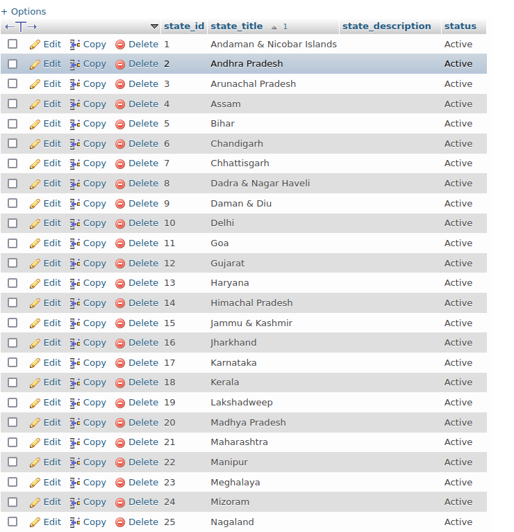

# UID Assignment 

Design an User Interface for "Booking Slots for Vaccine" in PHP which includes the following pages:
1. User log in page(Assume user is registered)
2. Select state and district and date (Slots) using list menus
3. Page to display slot is booked.


_1. User log in page(Assume user is registered)_


Frontend source : [w3schools](https://www.w3schools.com/howto/tryit.asp?filename=tryhow_css_login_form_modal)

_2. Select state and district and date (Slots) using list menus_


_3. Page to display slot is booked._


_Database tables_



Data source : [Dropbox](https://www.dropbox.com/s/irofrjn8eak85ku/indian_state_district_city.sql?dl=0)


## *Working Details*

```
Username : 1BY17CS005
Password : 1BY17CS005
```

```
Select State , District, Date for Checking the Slot.
```
```
Displays the Status.
```